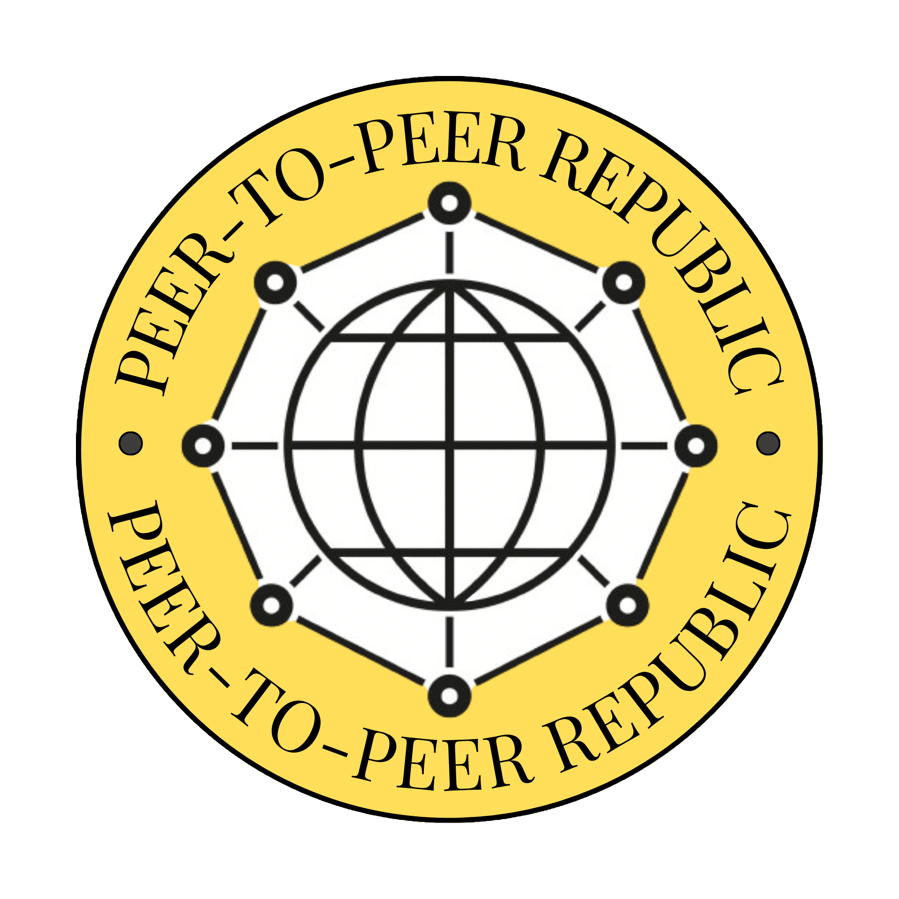

    

# Peer-to-Peer Republic

A movement, open republic of humans building peer-to-peer systems that redistribute power and reimagine the internet as a public good, not a product a platform sells.
